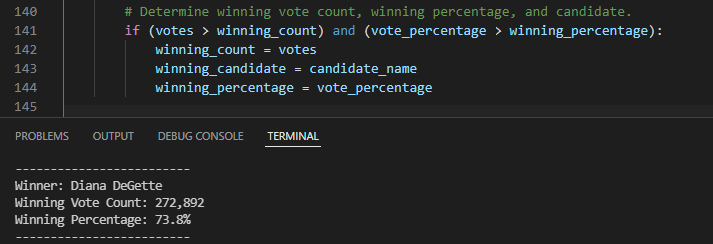

# Election_Analysis

## Project Overview
A Colorado Board of Elections employee has given you the following tasks to complete the election audit of a recent local congreessional election.

1. Calculate the total number of votes cast.
2. Get a complete list of candidate who received votes.
3. Calculate the total number of votes each candidate received.
4. Calculate the percentage of votes each candidate won.
5. Determine the winner of the election based on popular vote.

## Resources
- Data source: election_results.csv
- software: Python 3.10.2, VS Code 1.65.2

## Summary
The analysis of the election shows that:
- There were 369,711 votes cast in the election
- The candidates were:
  - Charles Casper Stockham
  - Diana Degette
  - Raymon Anthony Doane
- The candidate results were:
  - Charles Casper Stockham received 23.0% of the vote and 85,213 number of votes
  - Diana Degette received 73.8% of the vote and 272,892 number of votes
  - Raymon Anthony Doane received 3.1% of the vote and 11,606 number of votes
- The winner of the election was:
  - Diana DeGette, who receieeved 73.8% of the vote and 272,892 number of votes.

## Challenge Overview

### Overview of Election Audit: 
The election commission has requested some additional data to complete the audit:
  - The voter turnout for each county.
  - The percentage of votes from each county out of the total count.
  - The county with the highest turnout.

### Election-Audit Results: 

1. How many votes were cast in this congressional election?

2. Provide a breakdown of the number of votes and the percentage of total votes for each county in the precinct.

3. Which county had the largest number of votes?

4. Provide a breakdown of the number of votes and the percentage of the total votes each candidate received.

5. Which candidate won the election, what was their vote count, and what was their percentage of the total votes?

## Challenge Summary

### Election-Audit Summary:
Expanding the Election Audit to include voter turnout by county with candidates results has been a great way to take advantage of the convenience a script provides. The added insight can be a guide for future election performance, so that you may properly allocate resources where turnout is low or demographics are hard to reach.

A little time invested into customizing the script can provide on-demand analysis for years to come.

Modifying the script to produce turnout results by county is just one of many ways that minor adjustments to the code can reveal critical data. For example, we could also dive deeper and determine what percentage of each county voted for each candidate by adding an if-statement to the code. These type of Decision Statements are how the code runs calculations and all we've done is provide it with a data file.

Similarly, if this were a federal election, we could use the same script and change the county to states.

In short, no matter the number of candidates or counties, the script used to perform the Election Audit can be a valuable resourse for the board.

I am open to negotiation and available for consult if you are interested in talking further.